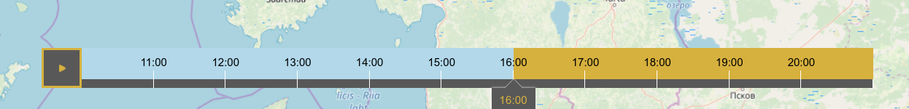

# MetOClient

MetOClient is a JavaScript library for map animations, based on OpenLayers 6. If you are looking for an older version, check out the `v4` branch.

An animation is defined by map layers containing time rules. The map standards it supports are WMS, WMTS and GeoJSON. The configuration is given in a JSON object which is an extension of a Mapbox style configuration.

An animation API is provided to extend OpenLayers map methods.


## Getting Started

### Using a module bundler

For production, the recommended method is to bundle the application together with its dependencies. In this case, the first step is to install the [`metoclient`](https://www.npmjs.com/package/@fmidev/metoclient) package:

```
npm install @fmidev/metoclient
```

The following code introduces MetOClient's basic usage in a modern environment. At first the MetOClient instance is created with a suitable options object. After that the map view renderer is called which returns a [promise](https://developer.mozilla.org/en-US/docs/Web/JavaScript/Reference/Global_Objects/Promise). Once it is fulfilled, any interaction with the map animation is possible. In the example code the animation player is started from the current time at a one second frame rate.

```js
import MetOClient from '@fmidev/metoclient';

const metoclient = new MetOClient(options);
metoclient.render().then(function (map) {
  metoclient.play({
    delay: 1000,
    time: Date.now()
  });
}).catch(err => {
  // statements to handle any exceptions
});
```

<a name="using-a-full-build"></a>
#### Using a full build

A full build is also available. In this case, to define a map animation on a web page the following four steps are required:

1.  Include MetOClient and optionally OpenLayers
2.  Define a map container as a div element
3.  Write the JSON configuration for an animation
4.  Add JavaScript code to create a map

The following code demonstrates initialization of the built MetOClient package and also the usage of OpenLayers commands to extend the map's functionality. In our example, a full screen control is added to the map once it is rendered for the first time.

```js
var metoclient = new fmi.metoclient.MetOClient(options)
metoclient.render().then(function (map) {
  map.addControl(new ol.control.FullScreen());
})
```

#### Examples

For fully working examples see the [examples](examples) directory. [The legacy example](examples/legacy) uses a traditional full build of the library.

## Animation API

MetOClient offers the following interface to control an animation:

-   [Constructor](#constructor)
    -   [new MetOClient(options)](#new-metoclient)
        -   [Advanced map view](#advanced-map-view)
        -   [Layer URL parameters](#layer-url)
        -   [Linked layers](#linked-layers)
        -   [Layer switcher control](#layer-switcher)
        -   [Layer times](#layer-times)
        -   [Relative time ranges](#relative-time)
            -   [Natural language](#natural-language)
            -   [Recurrence rules](#recurrence-rules)
            -   [JSON format](#json-format)
        -   [Absolute time ranges](#absolute-time)
            -   [WMS GetCapabilites format](#wms-getcapabilites)
-   [Methods](#methods)
    -   [get('map')](#get-map)
        -   [Map properties](#map-properties)
        -   [Map events](#map-events)
    -   [get('options')](#get-options)
    -   [get('timeSlider')](#get-timeslider)
        -   [Time slider properties](#timeslider-properties)
        -   [Time slider events](#timeslider-events)
    -   [next()](#next)
    -   [pause()](#pause)
    -   [play()](#play)
    -   [previous()](#previous)
    -   [render()](#render)
    -   [set('options', options)](#set-options)
-   [Static methods](#static-methods)
    -   [transform (coordinate, source, destination)](#transform)

---

<a name="constructor"></a>
### Constructor

The MetOClient object is initialized using a constructor method. The constructor places a map container in the target element as defined in options.

<a name="new-metoclient"></a>
#### new MetOClient(options)

options: [**Object**](https://developer.mozilla.org/fi/docs/Web/JavaScript/Reference/Global_Objects/Object) Configuration options.

The configuration object is an extension of [Mapbox Style Specification](https://docs.mapbox.com/mapbox-gl-js/style-spec/). Essentially, the configuration consists of general settings, data source definitions and layer definitions. The same source can be defined for multiple layers. Any Mapbox Style configuration is a valid configuration for MetOClient, but only a meaningful subset of properties in the specification are supported. On the other hand, the following additions are used:

<a name="advanced-map"></a>
##### Advanced map view

The root properties of the standard [Mapbox Style Specification](https://docs.mapbox.com/mapbox-gl-js/style-spec/) can be extended by any OpenLayers view options, e.g. projection or rotation.

In addition, the following root properties are supported:

`target`: [**String**](https://developer.mozilla.org/fi/docs/Web/JavaScript/Reference/Global_Objects/String) Id of the container element for the map.

`refreshInterval`: [**String**](https://developer.mozilla.org/fi/docs/Web/JavaScript/Reference/Global_Objects/String) Map refresh interval as [ISO\_8601 duration](https://en.wikipedia.org/wiki/ISO_8601#Durations) string, e.g. 'PT15M'.

`timeZone`: [**String**](https://developer.mozilla.org/fi/docs/Web/JavaScript/Reference/Global_Objects/String) Time zone defined in [IANA time zone database](https://en.wikipedia.org/wiki/List_of_tz_database_time_zones) format, e.g. `'Europe/Helsinki'`.

<a name="layer-url"></a>
##### Layer URL parameters

The layer's URL parameters can be specified as properties of a url object inside a layer definition.

Example:

```js
"url: {
  "service": "WMTS",
  "layer": "osm_finland:osm-finland",
  "tilematrixset": "ETRS-TM35FIN-FINLAND",
  "style": "",
  "request": "GetTile",
  "version": "1.0.0",
  "format": "image/png"
}
```

These values extend or replace corresponding parts of the tiles' URLs of a corresponding source definition.

<a name="linked-layers"></a>
##### Linked layers

Layers can be linked to be temporally sequential which makes them transition smoothly in animation. A typical case is to link weather observations and forecasts of the same quantity, for example rain radar images with rain forecasts. Another case is to link layers that contain different levels of data accuracy for different time ranges.

Linking is defined in the following properties in a layer configuration object:

`next`: [**String**](https://developer.mozilla.org/fi/docs/Web/JavaScript/Reference/Global_Objects/String) Layer id of the following layer.

`previous`: [**String**](https://developer.mozilla.org/fi/docs/Web/JavaScript/Reference/Global_Objects/String) Layer id of the previous layer.

For a single link it is sufficient to define either the next property of the first layer or the previous property of the latter layer. Of course, both can be defined to make the configuration easy to understand.

<a name="layer-switcher"></a>
##### Layer switcher control

The visual layer switcher control is included in the map. It is a third party OpenLayers control and can be removed with a standard [OpenLayes function](https://openlayers.org/en/latest/apidoc/module-ol_Map-Map.html#removeControl). The layer switcher is contained inside a div element with a class layer-switcher which can be styled or hidden via CSS styles.

The layer switcher is configured via layers following [metadata](https://docs.mapbox.com/mapbox-gl-js/style-spec/#layer-metadata) properties:

`title`: [**String**](https://developer.mozilla.org/fi/docs/Web/JavaScript/Reference/Global_Objects/String) Layer title in the layer switcher. A missing title field means that the layer won\'t be included in the layer switcher.

`type`: [**Object**](https://developer.mozilla.org/fi/docs/Web/JavaScript/Reference/Global_Objects/Object) Layer type. For base maps, the layer type is the base. In practice, the layer switcher only allows one base map to be visible at a time. Other type values do not have any effect.

Example layer definition for a base layer visible in the layer switcher:

```js
{
  "id": "osm-map",
  "source": "osm",
  "metadata": {
    "type": "base",
    "title": "OpenStreetMap"
  }
}
```

The layer switcher can be accessed as an OpenLayers map control. It is an instance of a [LayerSwitcher](https://github.com/walkermatt/ol-layerswitcher#layerswitcher).

<a name="layer-times"></a>
##### Layer times

The core configuration of a layer animation is to define the time points which are animated for each layer. It is quite common situation that not every layer has data available for a similar time range or frequency. For example, only historical weather observations are available and, on the other hand, weather forecasts might not be meaningful information for history even if they would be available.

A layer\'s animation time points are defined as following the properties of a time object inside a layer definition:

`source`: [**String**](https://developer.mozilla.org/fi/docs/Web/JavaScript/Reference/Global_Objects/String) Optional source reference that can be used to request GetCapabilities data containing a layer\'s available time dimension data. As a default layer\'s own source reference is used.

`range`: **[String](https://developer.mozilla.org/fi/docs/Web/JavaScript/Reference/Global_Objects/String) \| [Object](https://developer.mozilla.org/fi/docs/Web/JavaScript/Reference/Global_Objects/Object)** Definitions for layer\'s requested time points. These times are only requested if they are defined as available in the layer's GetCapabilities response. Several different formats are provided to express the range, so as to fulfill different use cases. Let\'s review them next.

<a name="relative-time"></a>
##### Relative time ranges

The first use case is to use time ranges relative to current real-world time. This is a common scenario when speaking about daily weather observations and forecasts.

<a name="natural-language"></a>
###### Natural language

The most straightforward way to define time ranges in relation to the present time is to use simple natural language rule strings. In MetOClient, a natural language parser is modified from the third party library [rrule.js](https://github.com/jakubroztocil/rrule)

Examples of typical rule strings:

**Example 1: Weather observations**

The last five observations hourly:

```js
"time": {
  "range": "every hour for 5 times history"
}
```

For example, if the time is now 10:10, the previous time range would request layer times at 5:00, 6:00, 7:00, 8:00 and 9:00.

**Example 2: Forecasts**

Two last forecasts in history and five in the future hourly:

```js
"time": {
  "range": "every hour for 2 times history AND every hour for 5 times"
}
```

For example, if time is now 10:10, the previous time range would request layer times at 8:00, 9:00, 10:00, 11:00, 12:00, 13:00 and 14:00. Historical forecasts are useful when a forecast layer is paired with a observation layer, and it is possible that there is a delay with the latest observations.

**Example 3: Irregular time data**

Not every layer contains regularly timed data. For example satellite weather data may be totally irregular.

```js
"time": {
  "range": "data 25 hours history"
}
```

The previous time range would contain all the time points offered by the layer during the latest 25 hours.

The following tokens are available in natural language rule strings, based on but not limited to the [English interface](https://github.com/jakubroztocil/rrule/blob/master/src/nlp/i18n.ts) of the [rrule.js](https://github.com/jakubroztocil/rrule) library:

- history: /^history/i,
- and: /^and/i,
- number: /^[1-9][0-9]*/,
- numberAsText: /^(one|two|three)/i,
- every: /^every/i,
- day(s): /^days?/i,
- weekday(s): /^weekdays?/i,
- week(s): /^weeks?/i,
- hour(s): /^hours?/i,
- minute(s): /^minutes?/i,
- month(s): /^months?/i,
- year(s): /^years?/i,
- on: /^(on|in)/i,
- at: /^(at)/i,
- the: /^the/i,
- first: /^first/i,
- second: /^second/i,
- third: /^third/i,
- nth: /^([1-9][0-9]*)(\.|th|nd|rd|st)/i,
- last: /^last/i,
- for: /^for/i,
- time(s): /^times?/i,
- until: /^(un)?til/i,
- monday: /^mo(n(day)?)?/i,
- tuesday: /^tu(e(s(day)?)?)?/i,
- wednesday: /^we(d(n(esday)?)?)?/i,
- thursday: /^th(u(r(sday)?)?)?/i,
- friday: /^fr(i(day)?)?/i,
- saturday: /^sa(t(urday)?)?/i,
- sunday: /^su(n(day)?)?/i,
- january: /^jan(uary)?/i,
- february: /^feb(ruary)?/i,
- march: /^mar(ch)?/i,
- april: /^apr(il)?/i,
- may: /^may/i,
- june: /^june?/i,
- july: /^july?/i,
- august: /^aug(ust)?/i,
- september: /^sep(t(ember)?)?/i,
- october: /^oct(ober)?/i,
- november: /^nov(ember)?/i,
- december: /^dec(ember)?/i,
- comma: /^(,\s*|(and|or)\s*)+/i
- SKIP: /^[ \r\n\t]+|^\.$/

<a name="recurrence-rules"></a>
###### Recurrence rules

[Recurrence rules](https://icalendar.org/iCalendar-RFC-5545/3-8-5-3-recurrence-rule.html) closely resembling [iCalendar (RFC 5545)](https://icalendar.org/RFC-Specifications/iCalendar-RFC-5545/) specification can be given as a string. For examples, see a [rule generator tool](https://icalendar.org/rrule-tool.html). There are some [differences](https://github.com/jakubroztocil/rrule#differences-from-icalendar-rfc) compared to the specification.

<a name="json-format"></a>
###### JSON format

The same information can be given as a JSON object as defined in [options object](https://github.com/jakubroztocil/rrule#rrule-constructor) in RRule constructor.

<a name="absolute-time"></a>
##### Absolute time ranges

Another totally different use case is to animate data between static time limits instead of around the present time.

<a name="wms-getcapabilites"></a>
###### WMS GetCapabilites format

For a static time range, MetOClient supports the same time range format as used in [WMS 1.3.0 GetCapabilities](http://portal.opengeospatial.org/files/?artifact_id=14416), which is an extension to the ISO 8601:2000 standard. Thus, a list of several times is expressed by separating valid time values with a comma (\",\"). A temporal range is expressed using the syntax \"start/end/period\" to indicate the start time of the data, the ending time, and the time resolution.

**Example 1: Comma-separated list**

```js
"time": {
  "range": "1999-01-01,1999-04-01,1999-07-01,1999-10-01"
}
```

**Example 2: Periodic interval**

```js
"time": {
  "range": "2000-06-18T14:30Z/2000-06-18T14:30Z/PT30M"
}
```

<a name="methods"></a>
### Methods

<a name="get-options"></a>
#### destroy

Removes the animation map.

---

<a name="get-map"></a>
#### get(\'map\')

**Returns**: [**Object**](https://developer.mozilla.org/fi/docs/Web/JavaScript/Reference/Global_Objects/Object) The animation map.

The map is a standard OpenLayers map and the full [OpenLayers map API](https://openlayers.org/en/latest/apidoc/module-ol_Map-Map.html) can be used to interact with it. There are two exceptions that should not be edited via OpenLayers commands because they are for the library's internal use only:

1.  layers with an id property starting with the prefix 'metoclient:'
2.  object properties which start with the prefix 'metoclient:'

Simple map manipulation via OpenLayers commands does not need OpenLayers as a dependency but direct references to other OpenLayers classes requires it.

If metoclient is an instance created by the MetOClient constructor, then the usage is as follows:

```js
let map = metoclient.get('map')
```

<a name="map-properties"></a>
##### Map properties

MetOClient extends OpenLayers map using the following properties:

-   `time` [**Number**](https://developer.mozilla.org/docs/Web/JavaScript/Reference/Global_Objects/Number) Current animation time as the number of milliseconds elapsed since January 1, 1970, 00:00:00 UTC.

-   `playing` [**Boolean**](https://developer.mozilla.org/docs/Web/JavaScript/Reference/Global_Objects/Boolean) Status of animation being currently played.

These properties are available as any other OpenLayers map property:

```js
metoclient.get('map').get(propertyName)
```

<a name="map-events"></a>
##### Map events

Any OpenLayers map event is available. For example, following fires when map rendering is complete:

```js
metoclient.get('map').on('rendercomplete', listener)
```

The following can be used to notify about map property changes:

```js
metoclient.get('map').on('change:properyName', listener)
```

This can be especially useful for MetOClient\'s own map properties discussed in the previous chapter:

The following fires when animation time is changed:

```js
metoclient.get('map').on('change:time', listener)
```

And the following fires when animation is started or paused:

```js
metoclient.get('map').on('change:playing', listener)
```
---

<a name="get-options"></a>
#### get('options')

**Returns**: [**Object**](https://developer.mozilla.org/fi/docs/Web/JavaScript/Reference/Global_Objects/Object) The animation options.

Gets the animation options that are derived from the initial configuration and reflect the current animation view.

---

<a name="get-timeslider"></a>
#### get('timeSlider')

**Returns**: [**Object**](https://developer.mozilla.org/fi/docs/Web/JavaScript/Reference/Global_Objects/Object) The time slider.

The time slider is a standard OpenLayers control and the full [OpenLayers control API](https://openlayers.org/en/latest/apidoc/module-ol_control_Control-Control.html) can be used to interact with it.

<a name="timeslider-properties"></a>
##### Time slider properties

The time slider control includes the following properties:

-   `timeZone` [**String**](https://developer.mozilla.org/fi/docs/Web/JavaScript/Reference/Global_Objects/String) Time zone defined in [IANA time zone database](https://en.wikipedia.org/wiki/List_of_tz_database_time_zones) format, e.g. `'Europe/Helsinki'` or in [any other string representation parsed by Luxon](https://moment.github.io/luxon/docs/manual/zones.html#specifying-a-zone).

-   `timeZoneLabel` [**String**](https://developer.mozilla.org/fi/docs/Web/JavaScript/Reference/Global_Objects/String) Optional time zone information displayed in the time slider.

These properties are available as any other OpenLayers property:

```js
metoclient.get('timeSlider').get(propertyName)
```

<a name="timeslider-events"></a>
##### Time slider events

The following fires when the animation time zone is changed:

```js
metoclient.get('timeSlider').on('change:timeZone', listener)
```

And the following fires when the time zone label is changed:

```js
metoclient.get('timeSlider').on('change:timeZoneLabel', listener)
```
---

<a name="next"></a>
#### next()

Moves the animation time one step forwards.

---

<a name="pause"></a>
#### pause()

Pauses the animation player.

---

<a name="play"></a>
#### play()

Starts playing the animation from the current time position. The animation repeats from the beginning until it is paused.

---

<a name="previous"></a>
#### previous()

Moves the animation time one step backwards.

---

<a name="render"></a>
#### render()

**Returns**: [**Promise**](https://developer.mozilla.org/fi/docs/Web/JavaScript/Reference/Global_Objects/Promise) A promise object.

Renders the animation after evaluating the relative time values and updating layer capabilities from the server.

---

<a name="set-options"></a>
#### set('options', options)

`options`: [**Object**](https://developer.mozilla.org/fi/docs/Web/JavaScript/Reference/Global_Objects/Object) Animation configuration options.

Sets the animation options and refreshes the map view.

<a name="methods"></a>
### Static methods

<a name="transform"></a>
#### transform(coordinate, source, destination)

`coordinate`: [**Array**](https://developer.mozilla.org/en-US/docs/Web/JavaScript/Reference/Global_Objects/Array) Coordinate.\
`source`: [**String**](https://developer.mozilla.org/fi/docs/Web/JavaScript/Reference/Global_Objects/String) Source projection.\
`destination`: [**String**](https://developer.mozilla.org/fi/docs/Web/JavaScript/Reference/Global_Objects/String) Destination projection.

**Returns**: [**Array**](https://developer.mozilla.org/en-US/docs/Web/JavaScript/Reference/Global_Objects/Array) Coordinate.

Transforms a coordinate from source projection to destination projection.

## Visual styling

The map layout view can be fully customized with CSS styles. The time slider is an especially flexible component.

The map can be extended with any OpenLayers control or other functionality including third party plugins.

## Default controls

As a default, the animation map contains the following controls: Layer Switcher, Time slider and Zoom. The OpenLayers map function [addControl](https://openlayers.org/en/latest/apidoc/module-ol_Map-Map.html#addControl) can be used to provide a map with OpenLayers controls like FullScreen control in the previous [full build example](#using-a-full-build).

### Layer Switcher

The layer switcher is [a third party OpenLayers control](https://github.com/walkermatt/ol-layerswitcher). It can be used to toggle the animation layer\'s visibility and to select which one of the base maps will be visualized. In addition, MetOClient adds a layer legend selector to the layer switcher component.

### Time slider

The time slider is a custom OpenLayers component provided by MetOClient to visualize and control the current animation time. It has the following functions:

-   Play and pause buttons toggle animation playing state.
-   Slider thumb can be dragged to other time point.
-   Slider can be styled to contain a thumb and/or a value label. Vertical variation is also available using CSS styles.
-   Clicking the time slider on the left side of the current time position will move the animation time one step backwards. Correspondingly, clicking the time slider on the right side of the current time position will move animation time one step forwards.
-   Invisible areas on the left and right side of the time slider will also move the current time in a similar fashion.
-   If the current time point already matches, the clicked the step will be taken to another direction.
-   Long click and double click will immediately move the time to the clicked time.
-   As a default, time points are matched by a previous interval, so clicking for example the interval between 8:00 and 9:00 will move current time to 9:00.

#### Styling the time slider

The [examples](examples) contain several suitable CSS styles for the time slider to be adopted and adjusted. In addition, the following is a list of CSS selectors to define a custom style for the component. The corresponding HTML elements are visualized in the examples below.

1. div.fmi-metoclient-timeslider

2. div.fmi-metoclient-timeslider.rotated

3. div.fmi-metoclient-timeslider-clickable-container

4. div.fmi-metoclient-timeslider-pre-margin

5. div.fmi-metoclient-timeslider-pre-tools

6. button.fmi-metoclient-timeslider-play-button

7. button.fmi-metoclient-timeslider-play-button:hover

8. button.fmi-metoclient-timeslider-play-button.playing

9. div.fmi-metoclient-timeslider-frames-container

10. div.fmi-metoclient-timeslider-frame

11. div.fmi-metoclient-timeslider-frame.history > button.fmi-metoclient-timeslider-keyboard-accessible

12. div.fmi-metoclient-timeslider-frame.future > button.fmi-metoclient-timeslider-keyboard-accessible

13. div.fmi-metoclient-timeslider-indicator

14. div.fmi-metoclient-timeslider-indicator.first

15. div.fmi-metoclient-timeslider-indicator.last

16. div.fmi-metoclient-timeslider-indicator[data-status='working']

17. .history > div.fmi-metoclient-timeslider-indicator[data-status='success']

18. .future > div.fmi-metoclient-timeslider-indicator[data-status='success']

19. div.fmi-metoclient-timeslider-indicator[data-status='error']

20. div.fmi-metoclient-timeslider-frame-tick

21. div.fmi-metoclient-timeslider-frame-text-wrapper

22. div.fmi-metoclient-timeslider-post-tools

23. button.fmi-metoclient-timeslider-step-button

24. button.fmi-metoclient-timeslider-step-button:hover

25. div.fmi-metoclient-timeslider-post-margin

26. div.fmi-metoclient-timeslider-pointer

27. div.fmi-metoclient-timeslider-pointer-wrapper

28. div.fmi-metoclient-timeslider-pointer-wrapper:after

29. div.fmi-metoclient-timeslider-pointer-wrapper:before

30. div.fmi-metoclient-timeslider-pointer-wrapper:after

31. div.fmi-metoclient-timeslider-pointer-wrapper:before

32. div.fmi-metoclient-timeslider-pointer-handle

33. span.fmi-metoclient-timeslider-pointer-text

34. div.fmi-metoclient-timeslider-drag-listener

##### Pointer below the time line




##### Draggable circle inside the time line


##### Vertical time line


### Zoom

Zoom is a default OpenLayers [zoom control](https://openlayers.org/en/latest/apidoc/module-ol_control_Zoom-Zoom.html) to zoom in and out on the map.

## Buffering

After visualizing data for the current time step, MetOClient will load data to memory also for a previous and next time step. Thus switching one step forwards or backwards will update the map instantaneously. The browser cache offers another optimization: after a time step data is loaded the first time, the future visualizations of the same moment will be much faster, even if it is not an adjacent time step.

## Supported Browsers

All the new versions of the major browsers are supported, including desktop versions of Chrome, Firefox, Safari and Edge and mobile versions of Chrome and Safari. Also Internet Explorer 11 is supported but polyfills are needed for promises and Intl API, see [the legacy example](examples/legacy/index.html).

## Keyboard support
MetOClient supports keyboard navigation. UI element selection is made by the Tab key which moves from element to element from left to right and from up to down. Moving backward is Shift+Tab. Selection is made by pressing either Enter or Space key. Keyboard support is always on.

## Abbreviation

The abbreviation MetOClient comes from the words Meteorological Observation Client. Despite some optimizations related to meteorological use cases, all kinds of temporal data can be animated.

## License

This program is free software. It is distributed under an [MIT license](https://opensource.org/licenses/MIT).
